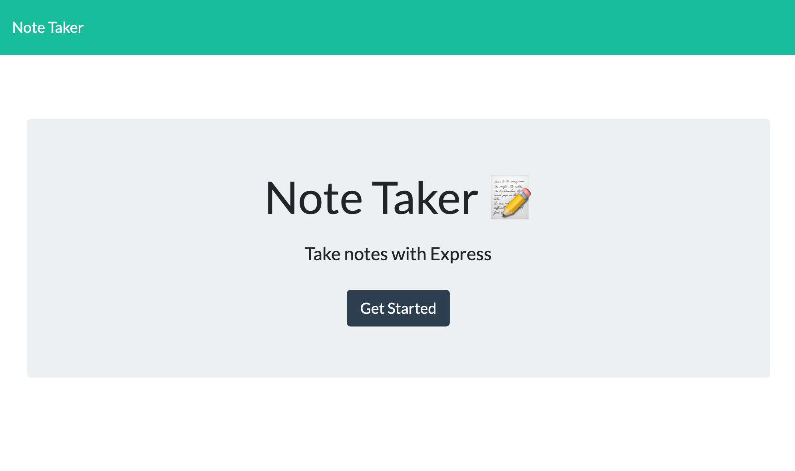
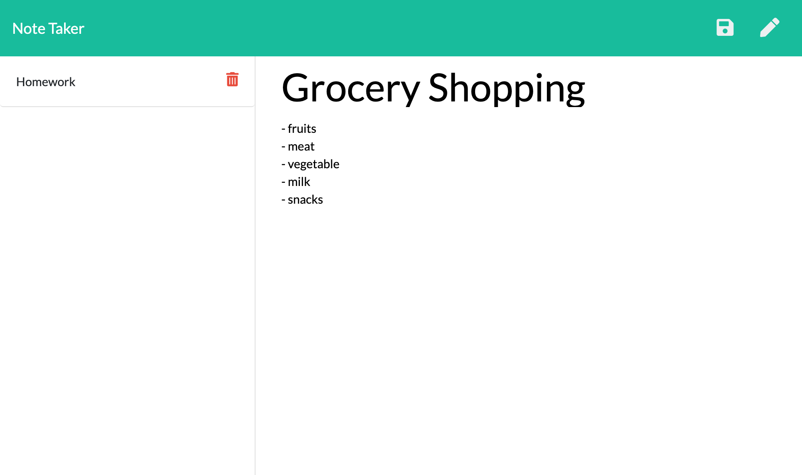

# note-taker
Homework 11 (Express)

## Submission on BCS
* The URL of the deployed application
* The URL of the GitHub repository

## Description

This is an application that can be used to 1) create and save notes; 2) view previously saved notes; & 3) delete previously saved notes. It uses an express backend and save + retrieve note data from a JSON file.

## User Story

AS A user, I want to be able to write and save notes

I WANT to be able to delete notes I've written before

SO THAT I can organize my thoughts and keep track of tasks I need to complete

## Business Context

For users that need to keep track of a lot of information, it's easy to forget or be unable to recall something important. Being able to take persistent notes allows users to have written information available when needed.

## Installation
"npm install" to install node dependecies
"npm install uniqid" to install uniqid

## Usage
"npm start" to run the script

## Screenshots

